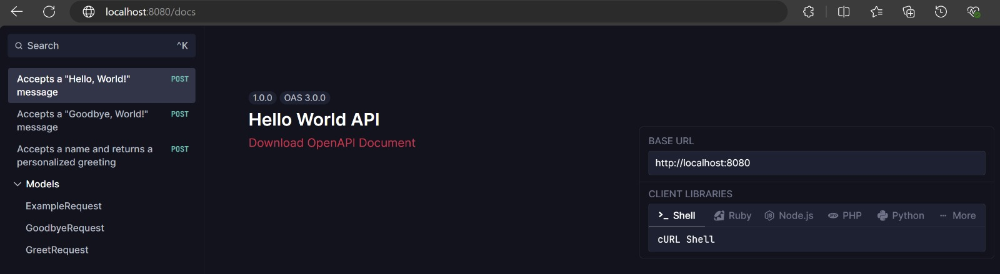

EinarCLI allows you to validate embedded OpenAPI contracts. It provides the flexibility to create the contract within your project and immediately validate it against the OpenAPI specification. This ensures that your API definitions are always up to standard, making it easier to maintain consistency and reliability throughout the development lifecycle.

## 🛠️ Generate a New Embedded Spec

Inside your project directory, run the following command to create a new Embedded Spec:

```sh
einar generate openapi customer-spec
```

The customer-spec will be created in the following directory structure:

```sh
/app
  /shared
    /openapi
      - customer_spec_test.go
      - customer_spec.go
      - customer_spec.json
```

Here's an example of how the generated code will look:
```sh
type CustomerSpec struct {
	APIReferenceHTML string
	HelloEndpoint    *contract.Endpoint
	GreetEndpoint    *contract.Endpoint
}

//go:embed customer_spec.json
var customer_spec []byte

func init() {
	ioc.Registry(NewCustomerSpec)
}

func NewCustomerSpec() (CustomerSpec, error) {
	apiReferenceHTML, err := scalar.ApiReferenceHTML(&scalar.Options{
		SpecContent: string(customer_spec),
	})
	if err != nil {
		return CustomerSpec{}, err
	}
	helloEndpoint, err := contract.LoadSpecEndpoint(
		contract.EndpointDetails{
			ContractData: customer_spec, 
			Path:         "/hello",
			HTTPMethod:   "POST",
			ContentType:  "application/json",
		},
	)
	if err != nil {
		return CustomerSpec{}, err
	}
	greetEndpoint, err := contract.LoadSpecEndpoint(
		contract.EndpointDetails{
			ContractData: customer_spec,
			Path:         "/greet",
			HTTPMethod:   "POST",
			ContentType:  "application/json",
		},
	)
	if err != nil {
		return CustomerSpec{}, err
	}
	return CustomerSpec{
		APIReferenceHTML: apiReferenceHTML,
		HelloEndpoint:    helloEndpoint,
		GreetEndpoint:    greetEndpoint}, nil
}
```

## 👨‍💻 Tutorial: How to Generate Spec Docs
Here’s an example of how to use the generated spec in an HTTP server GET request to serve spec documentation:

1.- Install the HTTP server if not installed:
```sh
einar install labstack-echo
```

2.- Generate your custom GET controller to serve your spec documentation:
```sh
einar generate get-controller serve-docs
```
The generated controller will look like:
```go
func init() {
	ioc.Registry(serveDocs, serverwrapper.NewEchoWrapper)
}
func serveDocs(e serverwrapper.EchoWrapper) {
	e.GET("/insert-your-custom-pattern-here", func(c echo.Context) error {
		return c.JSON(http.StatusOK, map[string]string{
			"message": "Unimplemented",
		})
	})
}
```
3.- Inject your spec using EinarIOC and serve it as HTML:
```go
func init() {
	ioc.Registry(serveDocs,
		serverwrapper.NewEchoWrapper,
		openapi.NewCreateCustomerSpec)
}
func serveDocs(
	e serverwrapper.EchoWrapper,
	spec openapi.CreateCustomerSpec) {
	e.GET("/docs", func(c echo.Context) error {
		return c.HTML(http.StatusOK, spec.APIReferenceHTML)
	})
}
```
4.- Run your app by executing `go run main.go`, and open http://localhost:8080/docs in your browser. You will see the following:


